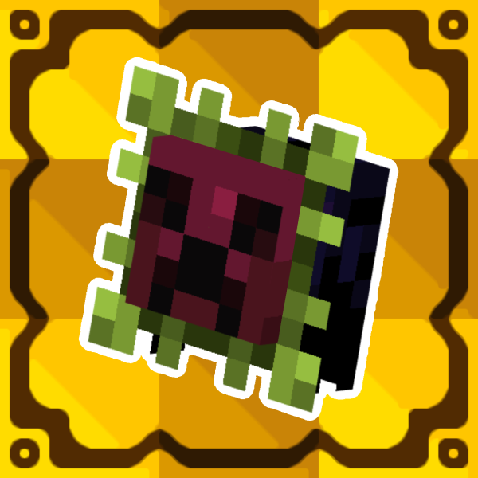

[English](README.md) | [Русский](README.ru.md)

# More Critters

New fantasy creatures in vanilla style for Minecraft 1.21.1 on NeoForge. This is an unofficial port of [More Critters](https://modrinth.com/mod/more-critters) by Portakal_Cevheri.

Every critter is good for something: food, potion ingredients, tools, weapons or armor. Besides the critters, the mod adds the Wandering Collector, who travels in a wagon with his Carrybug and buys critter drops; the Critter Atlas, a field guide to the critters; Critterlings, small collectible creatures that evolve at the Evolution Table and dance to music discs; fossils to dig up and display; ghost ships and other structures.

## Downloads

GitHub Release `v1.4.5`: [github.com/Nergan/more-critters-port](https://github.com/Nergan/more-critters-port/releases)

| File | Required | Notes |
| --- | --- | --- |
| `more_critters-1.4.5.jar` | Yes | This mod |
| `kotlinforforge-5.8.0-all.jar` | Yes | [Kotlin for Forge](https://modrinth.com/mod/kotlin-for-forge) |
| `geckolib-neoforge-1.21.1-4.9.3.jar` | Yes | [GeckoLib](https://modrinth.com/mod/geckolib) |
| `*-sources.jar` | No | Do not put this in `mods` |

Modrinth: [more-critters-port](https://modrinth.com/project/more-critters-port)

## Requirements

- Minecraft 1.21.1
- NeoForge 21.1.209 or newer
- Java 21
- Kotlin for Forge 5.8 or newer
- GeckoLib 4.9.3 or newer

## Install

Put `more_critters-1.4.5.jar`, `kotlinforforge-5.8.0-all.jar` and `geckolib-neoforge-1.21.1-4.9.3.jar` into the `mods` folder. The mod is needed on both the client and the server.

## Config

Server config, shared with every player. File: `config/more_critters-server.toml` in the game folder (or the server folder). To change the options for one world only, put a copy of it into `saves/<world>/serverconfig/more_critters-server.toml` (on a dedicated server: `world/serverconfig/more_critters-server.toml`); the copy overrides the file in `config/`. The NeoForge config screen opens from the mods list.

The original mod kept the same options in `config/morecritters-general.toml`. The port does not read that file.

| Key | Default | Meaning |
| --- | --- | --- |
| `mobs.can_remove_carrybug_saddle` | `true` | Players can take the saddle and chests off a Carrybug with shears |
| `mobs.bunbug_birth_number` | `4.0` | How many babies a Bunbug gives birth to, 0 to 64 |
| `mobs.snowflake_spider_inflict_frostbite` | `true` | Snowflake Spiders inflict Frostbite when they attack |
| `mobs.bouncelizard_regular_jump_height` | `0.6` | Upward speed a Bouncelizard gives to whoever lands on it, 0 to 10 |
| `mobs.bouncelizard_sleeping_jump_height` | `1.2` | The same for a sleeping Bouncelizard, 0 to 10 |
| `mobs.creeblossom_infection_rate` | `30.0` | A monster in a warm biome spawns with the Blossoming effect with a 1 in N chance |
| `mobs.warptrap_attack_endermen` | `true` | Warptraps attack Endermen |
| `mobs.shimmerwing_follow_blessed_player` | `true` | Shimmerwings follow players who have End's Blessing |
| `mobs.balloon_rat_poisons_target` | `true` | Balloon Rats poison whoever attacks them |
| `mobs.animate_bomb_jelly` | `true` | Bomb Jellies have animated textures |
| `mobs.small_bomb_jelly_explosion_power` | `2.0` | Explosion power of a small Bomb Jelly, 0 to 100. The explosion does not break blocks; TNT is 4 |
| `mobs.medium_bomb_jelly_explosion_power` | `3.0` | The same for a medium Bomb Jelly |
| `mobs.large_bomb_jelly_explosion_power` | `4.0` | The same for a large Bomb Jelly |
| `mobs.black_iropod_chance` | `100.0` | An Iropod is black with a 1 in N chance |
| `mobs.can_shadelet_jumpscare_player` | `true` | Shadelets can jumpscare players |
| `mobs.nervoid_infection_rate` | `50.0` | An Enderman in the End spawns with the Endfected effect with a 1 in N chance |
| `mobs.quartermaster_heal_cooldown` | `150.0` | Ticks a Corpse Quartermaster waits between heals (20 ticks = 1 second) |
| `mobs.captain_summon_cooldown` | `600.0` | Ticks a Corpse Captain waits between calls for backup |
| `mobs.tank_shoot_cooldown` | `200.0` | Ticks a Corpse Tank waits between shots |
| `items.webbed_requirement` | `50.0` | A Web Sack webs mobs whose maximum health is this or lower |
| `blocks.freezing_cobweb_freeze` | `true` | Freezing Cobwebs freeze mobs caught in them |

## License

The port's Gradle project, Kotlin code and NeoForge wiring are MPL-2.0 (`LICENSE`). The code and assets come from More Critters and stay MIT (`LICENSE-MORE-CRITTERS`, Copyright (c) 2025-2026 Portakal Cevheri). The original has no public source code; [`docs/original-license`](docs/original-license/README.md) shows that it was published under MIT.
